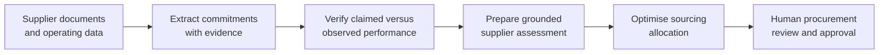

# Supplier Allocation Intelligence

An end-to-end, human-in-the-loop prototype for quarterly procurement allocation at ABC Manufacturing SE, a fictional company.

The system generates a synthetic supplier archive, extracts contractual commitments with evidence references, compares commitments against observed delivery and quality performance, detects drift, and proposes an allocation scenario. It never creates purchase orders: a procurement reviewer approves or adjusts the recommendation.

## Quick start

Install uv once if it is not already available:

```bash
curl -LsSf https://astral.sh/uv/install.sh | sh
```

Restart your terminal after installation, then run:

```bash
uv sync --all-groups
uv run python scripts/generate_demo_data.py
uv run python scripts/run_pipeline.py
uv run streamlit run app.py
```

## Prototype flow

1. Generate synthetic contracts, audits, certificates, ERP delivery data, and defect records.
2. Extract source-grounded supplier commitments.
3. Verify delivery, quality, capacity, certification, and country-risk signals.
4. Create a reviewable supplier scorecard and detect performance drift.
5. Optimise an allocation under demand, capacity, concentration, and country-exposure constraints.

## Workflow



Deterministic verification remains authoritative. The optional local LLM only produces an evidence-grounded explanation for human review; it never places orders or overrides sourcing constraints.

## Full local stack

`docker compose up -d` starts PostgreSQL (`localhost:5433`), Qdrant (`localhost:6333`), and Prefect (`localhost:4200`). Then run:

```bash
uv run python scripts/run_prefect_flow.py
uv run dbt run --project-dir dbt --profiles-dir dbt
```

The flow uses LangGraph to coordinate extraction, verification, and scoring; stages operational data in DuckDB; persists supplier facts, assessments, allocations, and approvals to PostgreSQL; and indexes PDF passages in Qdrant for evidence retrieval.

## Local LLM agents

The deterministic checks remain the control result. Ollama adds evidence-grounded procurement narratives without sending supplier evidence to a cloud model.

```bash
ollama pull qwen2.5:3b
ollama pull nomic-embed-text
cp .env.example .env
# Set OLLAMA_ENABLED=true in .env
uv run python scripts/run_prefect_flow.py
```

The default is `qwen2.5:3b`, a smaller model suitable for local development. Change `OLLAMA_MODEL` in `.env` to use another locally installed Ollama model.
Set `OLLAMA_MAX_CONCURRENCY` to control the bounded number of simultaneous supplier assessments.

The assessment agent uses contract lookup, delivery-performance analysis, and quality-performance analysis. Its cited documents are restricted to supplied evidence and its recommendation cannot weaken the deterministic verification status.

## Evaluation

The synthetic evaluation set contains 35 fictional suppliers with labelled expected verification statuses. Run:

```bash
uv run python scripts/evaluate_verification.py
uv run python scripts/evaluate_retrieval.py
```

## Safety boundary

All datasets are synthetic. The allocation output is a recommendation for human approval, not an order-placement instruction.

## Project summary

This portfolio project demonstrates evidence-grounded procurement intelligence: local semantic retrieval, bounded Ollama agent tools, deterministic supplier verification, constrained allocation optimisation, and human approval with an audit trail. It is a synthetic prototype, not a production procurement system.
